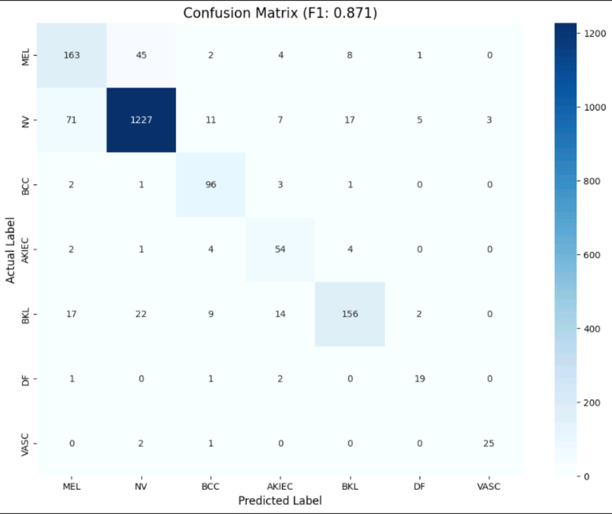

# Dermato-AI: Skin Lesion Classification & CBIR System

> A clinical decision-support tool for skin lesion analysis — combining deep learning classification with content-based image retrieval to give doctors not just a prediction, but visual *proof*.

[](https://www.python.org/)
[](https://pytorch.org/)
[](https://streamlit.io/)
[](https://challenge.isic-archive.com/landing/2018/)
[](LICENSE)

---

## Table of Contents

- [Overview](#overview)
- [The Problem](#the-problem)
- [Development Journey](#development-journey)
- [Architecture](#architecture)
- [Performance](#performance)
- [Project Structure](#project-structure)
- [Setup & Installation](#setup--installation)
- [Usage](#usage)
- [Technical Deep Dive](#technical-deep-dive)
- [CBIR: The Explainability Layer](#cbir-the-explainability-layer)

---

## Overview

Dermato-AI is a full-stack deep learning project built on the **ISIC 2018** dataset (10,015 dermoscopy images, 7 skin lesion classes). It addresses two critical real-world problems in medical AI:

1. **Class Imbalance** — dangerous cancers like Melanoma are rare, so naive models just predict "Mole" for everything and still get high accuracy
2. **Black-Box Problem** — a doctor can't act on "87% Melanoma" alone; they need clinical context

The solution: **Weighted Focal Loss** for a recall-focused classifier + **CBIR** to surface the 3 most visually similar historical cases as evidence.

---

## The Problem

### Dataset Breakdown (ISIC 2018)

| Class | Label | Count | % of Dataset |
|-------|-------|-------|-------------|
| Melanocytic Nevi | NV | 6,705 | 66.9% |
| Melanoma | MEL | 1,113 | 11.1% |
| Benign Keratosis | BKL | 1,099 | 11.0% |
| Basal Cell Carcinoma | BCC | 514 | 5.1% |
| Actinic Keratosis | AKIEC | 327 | 3.3% |
| Vascular Lesion | VASC | 142 | 1.4% |
| Dermatofibroma | DF | 115 | 1.1% |

The imbalance ratio between the majority class (NV) and the rarest class (DF) is nearly **60:1**. A model predicting "NV" for every single image would still achieve ~67% accuracy — completely useless clinically.

---

## Development Journey

This wasn't a straight line. Here's the honest progression:

### Stage 1: Baseline — "Why is this so bad?" (~45–60% Accuracy)

The first runs used a frozen ResNet-50 backbone with only the final classification head trained. Results were poor:
- The model converged quickly but plateaued around 45–55% validation accuracy
- Loss curves showed instability — the learning rate was too aggressive for transfer learning
- Root cause: one fixed LR across all parameters is wrong for fine-tuning; the pretrained backbone needs to be treated gently

### Stage 2: Differential Fine-Tuning — First Real Progress (~70–79% Accuracy)

Key changes that broke the plateau:
- **Unfroze `layer3` and `layer4`** of ResNet-50 while keeping earlier layers frozen — this let the model adapt ImageNet features to dermoscopic textures without destroying them
- **Introduced variable/differential learning rates**: lower LR for backbone layers, higher LR for the classification head
- **Added `WeightedRandomSampler`**: instead of letting the DataLoader pick randomly (which just feeds NV images all day), each batch was rebalanced at the sampler level so every class got fair exposure
- **CosineAnnealingLR scheduler**: smoother LR decay instead of step drops, preventing late-epoch instability

This got validation accuracy consistently above 79%, but there was a new problem: high accuracy was hiding terrible recall on the cancer classes.

### Stage 3: The Breakthrough — Focal Loss (~87% Accuracy, Real Cancer Detection)

The critical insight: **accuracy is the wrong metric for medical AI**.

A model with 90% accuracy that misses 40% of Melanomas is dangerous. The switch:

**From:** `CrossEntropyLoss` (treats all mistakes equally)  
**To:** `Weighted Focal Loss` (punishes cancer misses disproportionately)

Two mechanisms working together:
- **Class weights**: Melanoma assigned a weight of ~2.5×, forcing larger gradient updates when MEL is misclassified
- **Focal term** `(1 - p)^γ`: down-weights the loss from easy examples (NV images the model already classifies confidently) and concentrates learning on the hard cases the model keeps getting wrong

Result: raw accuracy slightly dropped to 87.1%, but Melanoma Recall jumped to **0.73** and AKIEC Recall to **0.83**. The model stopped being a "safe guesser" and became a "cancer detector."

### Stage 4: Advanced Optimization

- **448×448 resolution**: Upgraded from standard 224×224. Dermoscopic diagnosis relies heavily on fine-grained texture patterns (pigment network, globules, streaks) that are lost at lower resolution. Doubling the input size meaningfully improved feature quality.
- **Test-Time Augmentation (TTA)**: At inference, each image is evaluated 3 times (original + horizontal flip + 90° rotation) and predictions are averaged. This reduces variance from incidental orientation and makes the final output more stable and reliable.

---

## Architecture

```
Input Image (448×448×3)
        │
        ▼
┌─────────────────────────────────┐
│         ResNet-50 Backbone      │
│  (Pretrained on ImageNet)       │
│                                 │
│  layer1 ──── FROZEN             │
│  layer2 ──── FROZEN             │
│  layer3 ──── FINE-TUNED (1e-5)  │
│  layer4 ──── FINE-TUNED (1e-4)  │
│                                 │
│  AvgPool → 2048-dim vector      │◄── CBIR taps here
└─────────────────────────────────┘
        │
        ▼
  Dropout (0.4)
        │
        ▼
  FC Layer (2048 → 7)
        │
        ▼
  Softmax → Class Probabilities
```

**Optimizer:** AdamW with differential LRs + weight decay (`1e-4`)  
**Loss:** Weighted Focal Loss (`γ=2`, class weights proportional to inverse frequency)  
**Scheduler:** CosineAnnealingLR over 30 epochs  
**Checkpointing:** Save on best validation accuracy (`.pth`)

---

## Performance

### Final Metrics (Best Checkpoint)

| Metric | Score |
|--------|-------|
| Weighted F1-Score | **0.871** |
| Weighted AUC | **0.969** |
| Overall Validation Accuracy | **~89.8%** |

### Per-Class Recall (Key Cancer Classes)

| **Class**                      | **Recall** | **Clinical Significance**                             |
| ------------------------------ | ---------- | ----------------------------------------------------- |
| **Melanoma (MEL)**             | **72.4%**  | Most dangerous — false negatives are life-threatening |
| **Actinic Keratosis (AKIEC)**  | **83.1%**  | Pre-cancerous — early detection critical              |
| **Basal Cell Carcinoma (BCC)** | **93.2%**  | High performance due to distinct vascular patterns    |
| **Melocytic Nevi (NV)**        | **91.6%**  | Majority class; handled without class bias            |
| **Vascular Lesion (VASC)**     | **89.3%**  | High sensitivity for vascular structures              |

### Confusion Matrix Analysis
The model achieved a weighted **F1-score of 0.871**. The matrix below demonstrates the high sensitivity for critical classes like Melanoma and AKIEC achieved through Weighted Focal Loss.



### Training Progression (Selected Epochs)

```
Epoch  1 │ Train: 72.2% │ Val: 70.1%
Epoch  5 │ Train: 94.1% │ Val: 82.4%
Epoch  7 │ Train: 96.5% │ Val: 86.8% ← First major breakthrough
Epoch 14 │ Train: 98.6% │ Val: 87.4%
Epoch 18 │ Train: 99.5% │ Val: 89.1% ← Best loss checkpoint
Epoch 29 │ Train: 99.8% │ Val: 89.8% ← Final saved checkpoint
```

---

## Project Structure

```
dermato-ai-cbir/
│
├── app.py                  # Streamlit application (main entry point)
├── requirements.txt        # Python dependencies
├── packages.txt            # System-level dependencies (if needed)
│
├── model/
│   └── Updated_best.pth    # Trained ResNet-50 weights (~100MB, tracked via Git LFS)
│
├── cbir_index/
│   ├── features.npy        # 2048-dim embeddings for all training images
│   └── filenames.npy       # Corresponding filenames for retrieved images
│
├── notebooks/
│   └── training.ipynb      # Full training pipeline (Google Colab)
│
└── README.md
```

---

## Setup & Installation

### Prerequisites
- Python 3.9+
- Git LFS (for model weights)

### Clone & Install

```bash
# Clone the repo
https://github.com/saedm4151-irl/DermatoAI-Skin-Cancer-CBIR.git
cd dermato-ai-cbir

# Pull model weights via Git LFS
git lfs pull

# Install dependencies
pip install -r requirements.txt

# Run the app
streamlit run app.py
```

### requirements.txt

```
torch>=2.0.0
torchvision>=0.15.0
streamlit>=1.28.0
numpy>=1.24.0
scikit-learn>=1.3.0
Pillow>=9.0.0
```

---

## Usage

1. Launch the app with `streamlit run app.py`
2. Upload a dermoscopy image (JPG/PNG)
3. The model runs inference with TTA (3 augmented passes averaged)
4. You receive:
   - **Predicted class** with confidence score
   - **Top-3 most visually similar cases** from the training database with cosine similarity scores

> ⚠️ **Disclaimer**: This tool is a research prototype and is not approved for clinical use. All outputs should be reviewed by a qualified dermatologist.

---

## Technical Deep Dive

### Why Focal Loss Over Weighted CrossEntropy?

Standard weighted cross-entropy assigns higher loss to minority classes, but it still wastes capacity on easy majority-class examples the model already classifies with 99% confidence. Focal Loss adds a modulating term:

```
FL(p) = -α(1 - p)^γ * log(p)
```

When the model is confident (`p → 1`), `(1 - p)^γ → 0`, effectively suppressing the loss contribution from easy examples. The training budget gets redirected to the hard cases — exactly the rare cancer images that need it.

### Why 448×448?

Dermatologists diagnose by looking for subtle structural features: the pigment network, regression structures, blue-white veil, atypical vessels. At 224×224, these textures are spatially compressed. The 4× increase in pixel count (224² → 448²) preserves spatial frequency information that's clinically diagnostic.

### Why TTA?

A single forward pass is sensitive to incidental image properties — slight rotation, brightness variation from capture angle. TTA is cheap ensemble inference: run the same image through multiple augmented views and average the softmax outputs. It costs 3× inference time but meaningfully reduces variance on uncertain cases.

---

## CBIR: The Explainability Layer

The core insight: **a 2048-dim feature vector is a fingerprint of what the model "sees"**.

Before the final classification layer, ResNet-50 produces a 2048-dimensional embedding that encodes learned visual features. Two images with similar embeddings look similar to the model — similar texture, color distribution, structural patterns.

```python
# Feature extraction (strip the FC layer)
feature_extractor = nn.Sequential(*list(model.children())[:-1])

# At inference
query_embedding = feature_extractor(query_image)  # shape: (2048,)

# Retrieve top-K from index
similarities = cosine_similarity(query_embedding, training_embeddings)
top_k_indices = similarities.argsort()[-3:][::-1]
```

The CBIR index is pre-built offline: every training image is passed through the feature extractor, and the resulting 2048-dim vectors are saved to `features.npy`. At inference, a single cosine similarity matrix multiplication retrieves the top-3 matches in milliseconds.

**Clinical value**: Instead of "87% Melanoma" (unactionable), a doctor sees the prediction *alongside* 3 visually similar confirmed cases from the database — turning the AI from a black box into a transparent reference tool.

---

## Related Work

This project is directly informed by:
- Barata & Santiago (2021) — CBIR approaches for dermoscopic image analysis
- Lin et al. (2017) — [Focal Loss for Dense Object Detection](https://arxiv.org/abs/1708.02002)
- ISIC 2018 Challenge — [Task 3: Disease Classification](https://challenge.isic-archive.com/landing/2018/47/)

---

## Author

**Saed** — AI/ML Engineering Student, UAE  
[LinkedIn](https://linkedin.com/in/saedm4151-irl) · [GitHub](https://github.com/saedm4151-irl)

*Part of an ongoing portfolio in Deep Learning + LLM Engineering, built toward industry internships in the UAE.*
